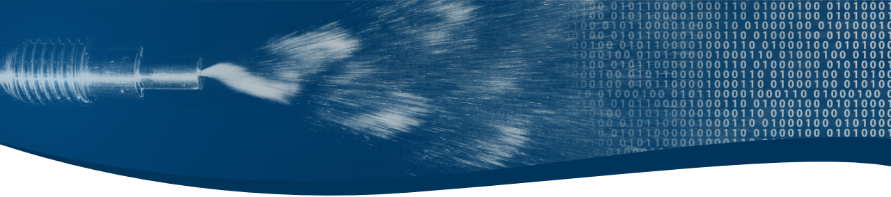

<h3 align="left">Hi there,</h3>

and welcome to FDX's public repository. FDX Fluid Dynamix is a Berlin based start-up, which working in the field of fluid dynamics, in particular in the field of fluidic devices. For more information about the devices and the company you might want to take a look at our [website](www.fdx.de). With the provided repositories we want to share our self developed code, hoping it might be helpful for you. In case you want to contribute to any of the projects please let us know, contributers are always welcome. 

You can also find us on the usual social media channels:

However, the best source of information is of course our homepage:

<a href="https://www.fdx.de">www.fdx.de</a>

<h3 align="left">Languages and Tools:</h3>

We are working with a braod variety of tools such as ANSYS CFX, OpenFOAM, Gerris, Basilisk and others. In addition, we use the following tools for which you may find some projects here (in the future):

             

<h3 align="left">Stats:</h3>

&nbsp;

